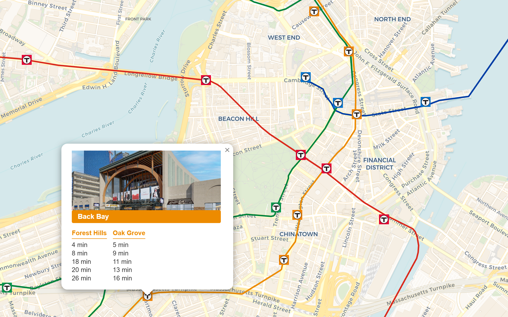

# mbta-map
Interactive Map and Tracker of Boston's MBTA subway system

https://mbta-map.up.railway.app/

---

## what this project is

I built a full stack web app that pulls Boston's live MBTA prediction data and displays it on an interactive map, following MBTA's real time display guidelines!

Click on any station on the map to see the nearest trains coming to that station!

## what I'm focusing on with this project
- async concurrency, efficiency, speed
- real time display logic
- full stack development
- caching design

I'm using this project to learn and focus on writing async code and actually understand the benefits of concurrency and efficiency. It's a great project to learn this because it naturally comes with full stack practice as well with the interactive map in JavaScript.

## stack
- FastAPI (Python) - async backend
- Redis - caching live MBTA predictions to avoid rate limits
- Vanilla JS - interactive map frontend
- Deployed on Railway

Hope you like it!
